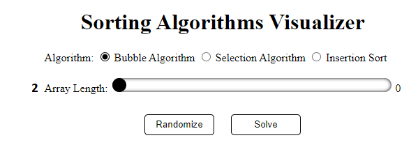
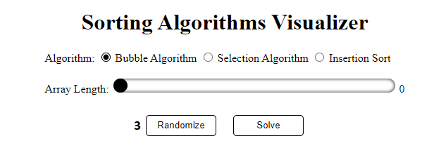
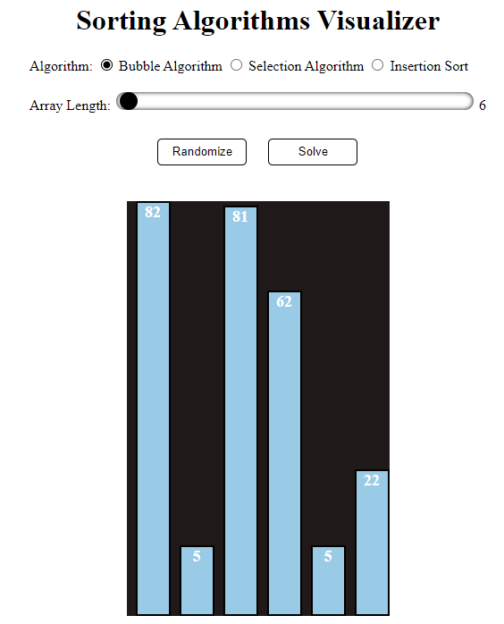
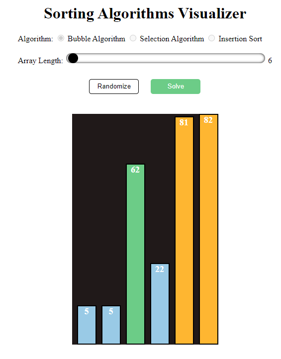

# Sorting-Algorithms-Visualizer
This project is a Sorting Algorithms Visualizer, it works to Visualize how the <b>Bubble algorithm</b>, the<b> selection algorithm</b>, and the <b>insertion algorithm</b> work, by graphing each column in it that represents an element in the array, where you initially choose the algorithm you want and then the length of the array you want and then work create a random array,<br>
<b>Technologies used in the project: </b>

&nbsp; &nbsp;
&nbsp; <br><br>
Let's take a quick look at each algorithm :<br>
- Bubble Sort : <br>
  Suppose we are trying to sort the elements in ascending order
  1. First Iteration (Compare and Swap)
  2. Starting from the first index, compare the first and the second elements.
  3. If the first element is greater than the second element, they are swapped.
  4. Now, compare the second and the third elements. Swap them if they are not in order.
  5. The above process goes on until the last element.
```javascript
function bubbleSort(array){
    for(var i = 0; i <= array.length-1; i++){
        // Last i elements are already in place
        for(var j = 0; j < ( array.length - i -1); j++){
            // Comparing two adjacent numbers 
            // and see if first is greater than second
            if(array[j] > array[j+1]){
            // Swap them if the condition is true 
              var temp = array[j]
              array[j] = array[j + 1]
              array[j+1] = temp
            }
        }
    }
}
```

- Selection Sort : <br>
  1. Set the first element as minimum.
  2. Compare minimum with the second element. If the second element is smaller than       minimum, assign the second element as minimum. 
  Compare minimum with the third element. Again, if the third element is smaller, then assign minimum to the third element otherwise do nothing. The process goes on until the last element.
  3. After each iteration, minimum is placed in the front of the unsorted list.
  4. For each iteration, indexing starts from the first unsorted element. Step 1 to 3 are repeated until all the elements are placed at their correct positions. <br>

```javascript
function selectionSort(inputArr) { 
    for(let i = 0; i < inputArr.length; i++) {
        // Finding the smallest number in the subarray
        let min = i;
        for(let j = i+1; j < inputArr.length; j++){
            if(inputArr[j] < inputArr[min]) {
                min=j; 
            }
         }
         if (min != i) {
             // Swapping the elements
             let tmp = inputArr[i]; 
             inputArr[i] = inputArr[min];
             inputArr[min] = tmp;      
        }
    }
    return inputArr;
}
```

- Insertion Sort : <br>
  1. The first element in the array is assumed to be sorted.Take the second element and store it separately in key. <br>
Compare key with the first element. If the first element is greater than key, then key is placed in front of the first element.
  2. Now, the first two elements are sorted.<br>
Take the third element and compare it with the elements on the left of it. Placed it just behind the element smaller than it. If there is no element smaller than it, then place it at the beginning of the array..
  3. Similarly, place every unsorted element at its correct position. <br>

```javascript
function insertionSort(arr) {
  for (let i = 1; i < arr.length; i++) {
    let currentValue = arr[i]
    let j
    for (j = i - 1; j >= 0 && arr[j] > currentValue; j--) {
      arr[j + 1] = arr[j]
    }
    arr[j + 1] = currentValue
  }
  return arr
}
```

## Usage

To use the Visualizer follow the following steps : <br>
  1. Choose the algorithm you want visualize 
  
  2. Choose the length of array 
  
  3. Click to 'Randomize' button to generate random array whose length is the length you  chose and whose values between 0-100 
   
  4. Finally click to 'solve' to start the visualize 
  
  
## Demo

To see the Demo : <br>


## Screenshots






